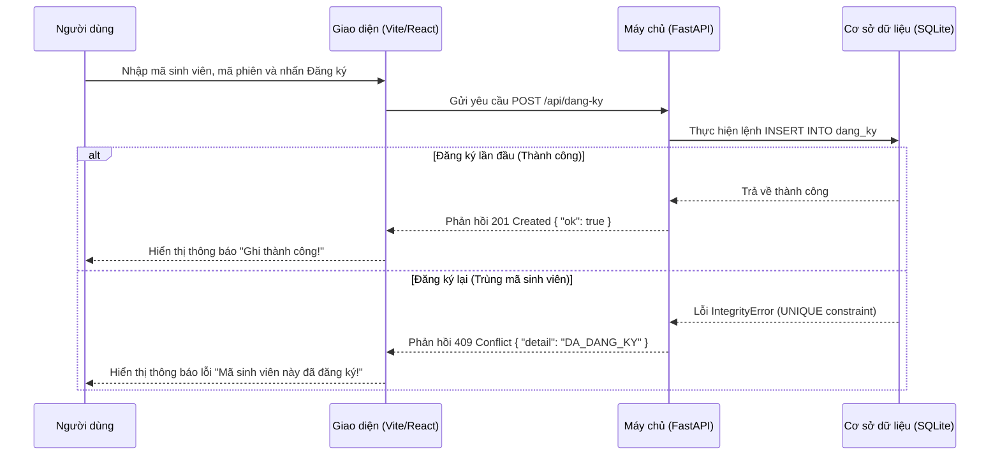

# Sơ đồ hoạt động của hệ thống Đăng ký Ngày hội việc làm

```mermaid
sequenceDiagram
    participant User as Người dùng
    participant UI as Giao diện (Vite/React)
    participant API as Máy chủ (FastAPI)
    participant DB as Cơ sở dữ liệu (SQLite)

    User->>UI: Nhập mã sinh viên, mã phiên và nhấn Đăng ký
    UI->>API: Gửi yêu cầu POST /api/dang-ky
    API->>DB: Thực hiện lệnh INSERT INTO dang_ky

    alt Đăng ký lần đầu (Thành công)
        DB-->>API: Trả về thành công
        API-->>UI: Phản hồi 201 Created { "ok": true }
        UI-->>User: Hiển thị thông báo "Ghi thành công!"
    else Đăng ký lại (Trùng mã sinh viên)
        DB-->>API: Lỗi IntegrityError (UNIQUE constraint)
        API-->>UI: Phản hồi 409 Conflict { "detail": "DA_DANG_KY" }
        UI-->>User: Hiển thị thông báo lỗi "Mã sinh viên này đã đăng ký!"
    end
```
